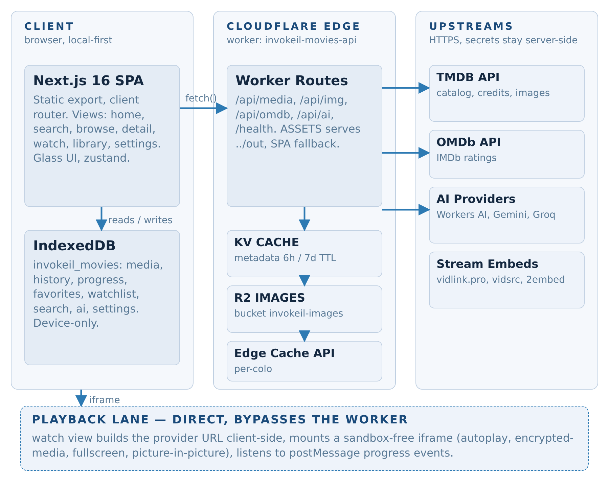
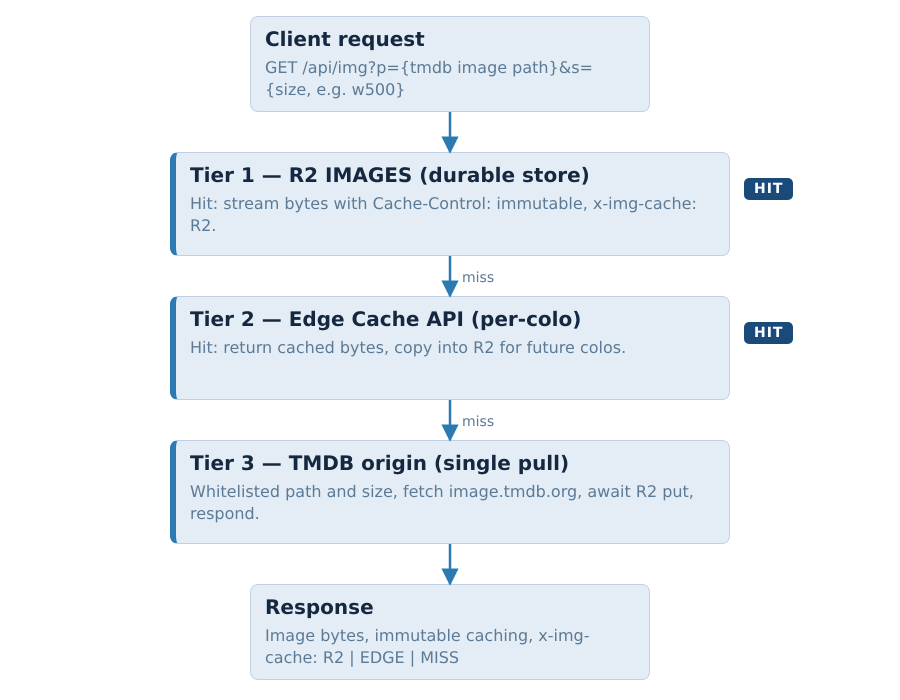
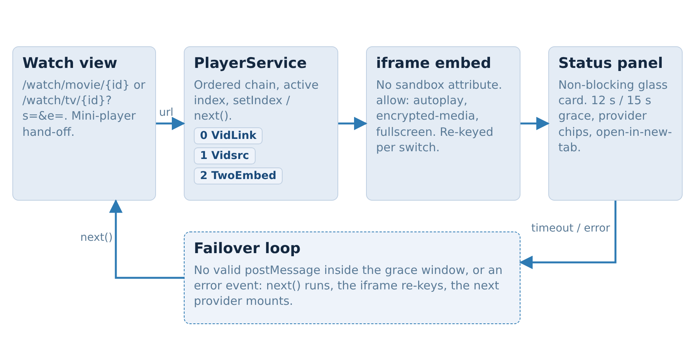
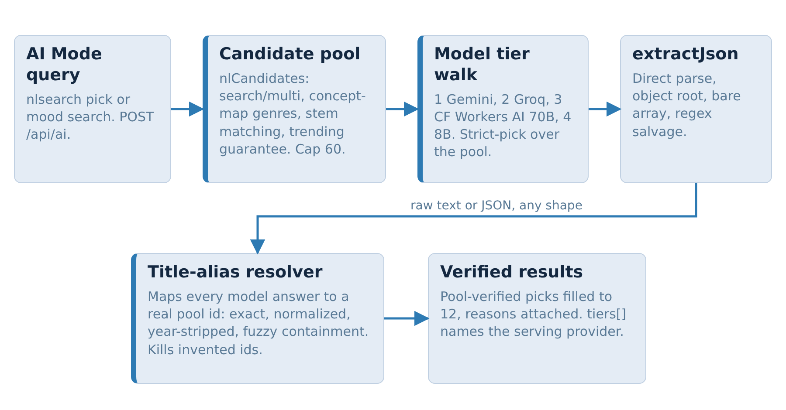

# 🏛️ Architecture — Movies by InvokeIL

> Status: production · Live at [movies.invokeil.cfd](https://movies.invokeil.cfd)
> Companion docs: [README.md](./README.md) · [SECURITY.md](./SECURITY.md)

Movies by InvokeIL is a **local-first SPA served by a single Cloudflare
Worker** that also acts as the only API surface. One custom domain, one
Worker, three storage products (Static Assets, KV, R2) — everything on the
free tier, with the browser holding zero credentials.

---

## 1. System topology



```
┌──────────────────────────── Browser (SPA) ────────────────────────────┐
│  Next.js 16 static export · React 19 · Tailwind 4 · Dexie (IndexedDB) │
│  watch history · continue-watching · library · preferences            │
└──────────────┬────────────────────────────────────────────────────────┘
               │  same-origin /api/*  (no CORS needed in production)
┌──────────────▼──────────────────── Cloudflare Worker ─────────────────┐
│  /api/media   metadata gateway      → Cache API → KV → TMDB           │
│  /api/img     image proxy           → R2 → Cache API → image.tmdb.org │
│  /api/omdb    ratings enrichment    → KV (7 d) → OMDb (key injected)  │
│  /api/ai      AI recommendation     → Gemini → Groq → Workers AI      │
│  /api/tmdb/*  raw TMDB passthrough  → edge-cached                     │
│  /health      liveness probe                                          │
│  everything else → Static Assets (../out, SPA fallback to index.html) │
└───────────────────────────────────────────────────────────────────────┘
```

**Why a Worker in front of everything:** it is the only place that holds
provider keys, it collapses repeat upstream calls with two cache tiers, it
normalises TMDB payloads into one `UnifiedMedia` shape the UI consumes, and it
serves the static SPA from the same origin so the whole product is a single
deploy.

## 2. Metadata flow (`/api/media`)

`worker/src/media-gateway.ts` implements one query contract for the whole UI:
`trending`, `popular-movies`, `popular-tv`, `anime`, `top-rated`,
`new-releases`, `genre`, `search`, `detail`, `similar`, `mood`.

1. **Cache API (L1, edge colo)** — keyed on a synthetic origin
   (`https://cache.invokeil.internal/<tmdb-path>`) so the Workers Cache API
   always works; API keys are stripped from cache keys. TTLs: lists 5 min,
   detail 10 min, search/mood 60 s. Hit → `x-cache: HIT`, zero upstream cost.
2. **KV (L2, global)** — `media:`-prefixed JSON entries with 6 h (lists) /
   7 d (detail) TTLs survive cache eviction and cold colos. Search results are
   cached **after ranking** under `searchres:<query>[.<type>]` for 24 h, so
   the first viewer pays the TMDB round-trip and every later search — from
   any user, any device — is served straight from CF storage. Empty result
   sets are never cached (a TMDB indexing lag can't poison a query).
3. **TMDB upstream** — Bearer token auth when `TMDB_API_TOKEN` is set,
   otherwise an optional provisioned v3 `TMDB_DEMO_KEY` secret; 12 s timeout;
   every failure degrades to `200 {results:[]}` (only `detail` can 404) so the
   UI never crashes on upstream hiccups.
4. **Mapping** — TMDB payloads are normalised into `UnifiedMedia`
   (`id: "movie-123" | "tv-456"`, `mediaType: 'anime'` for Japanese-animation
   TV, poster/backdrop/profile paths, cast, seasons, ratings…), which the
   client renders directly. `action=search` also accepts an optional
   `&type=movie|tv|anime` scope filter applied after ranking.

On the client, `src/lib/services/search-engine.ts` adds a local intent layer
on top of this contract: genre-alias detection with typo tolerance
(Levenshtein ≤ 2), "did you mean" correction against recent searches +
genres, deterministic spelling-variant retries, descriptive-query detection
that hands off to AI Mode, and a merge step that ranks title matches above
genre-browse results.

## 3. Image pipeline (`/api/img`)



Posters/backdrops/profiles are requested as
`/api/img?p=<tmdb-path>&s=<size>` and resolved through a strict chain:

1. **R2 (bucket `invokeil-images`)** — permanent store, served with
   `cache-control: public, max-age=31536000, immutable`.
2. **Edge Cache API** — second-layer hit when R2 is cold.
3. **`image.tmdb.org`** — origin fetch; the response is streamed to the client
   **and awaited into R2**, so the very first viewer pays the origin cost once
   and everyone after is served from Cloudflare storage forever.

Whitelist guards: poster/backdrop/profile path shapes and known size tokens
only; traversal attempts and unknown params are rejected with 400.

## 4. Player flow (VidLink)



- Watch view builds `https://vidlink.pro/movie/{tmdbId}` or
  `https://vidlink.pro/tv/{tmdbId}/{s}/{e}` and renders it in an `<iframe>`
  **without** a `sandbox` attribute (VidLink feature-detects sandboxing and
  refuses to start).
- `allow="autoplay; clipboard-write; encrypted-media; fullscreen;
  picture-in-picture"` covers the player's needs; progress is tracked
  client-side (Dexie) so continue-watching works even though the iframe is
  third-party.
- If the embed cannot start (network restrictions, region, provider outage),
  a **glass fallback panel** explains the failure and offers an
  "Open player in new tab" escape hatch.

## 5. AI chain (`/api/ai`)



`POST /api/ai { mode: recommend|mood|explain, query, profile, candidates }`
walks a strict fallback chain, 8 s timeout per tier:

| Tier | Provider | Notes |
|---|---|---|
| 1 | **Gemini** (`GEMINI_API_KEY`) | `x-goog-api-key` header, JSON-mode prompt |
| 2 | **Groq** (`GROQ_API_KEY`) | `llama-3.3-70b-versatile`, Bearer auth |
| 3 | **Workers AI** (`ai` binding) | runs on Cloudflare GPUs, no external key |

Responses are strict JSON, parsed and validated; a 10-minute in-memory cache
keyed on the full payload makes repeat queries free. The response always
includes which `provider` served the answer, and `fallback: true` when the
chain degraded to a safe local ranking.

## 6. Local-first data layer

All user state lives in IndexedDB (Dexie) in the browser:

| Store | Contents |
|---|---|
| history | watched titles with timestamps + poster paths |
| progress | per-title playback position (seconds) for continue-watching |
| library | My List entries with watch-state tabs |
| prefs | palette choice, playback defaults, UI toggles |

Nothing here is ever transmitted; Settings → Storage shows exact usage and
offers a one-tap wipe. The Worker keeps no per-user state of any kind.

## 7. Caching layers summary

| Layer | Scope | TTL | Invalidation |
|---|---|---|---|
| Browser HTTP cache | images (`/api/img`) | 1 year, immutable | content-addressed URLs |
| Edge Cache API (L1) | TMDB JSON, image bytes | 1–10 min per action | TTL expiry |
| KV (L2) | TMDB JSON | 6 h lists / 7 d detail | TTL expiry |
| R2 | image bytes | permanent | never (immutable art) |
| Worker memory | AI results | 10 min | isolate restart |

## 8. Deployment topology

- `bun run build` → Next.js static export in `./out`.
- `worker/wrangler.jsonc` binds that directory as **Static Assets**
  (`not_found_handling: single-page-application`) so client-side routes like
  `/watch/movie/123` resolve to the SPA shell.
- `routes.custom_domain: movies.invokeil.cfd` — same-origin API + assets.
- `account_id` is **not committed**; `worker/deploy.sh` sources
  `../.env.cloudflare` (git-ignored) exporting `CLOUDFLARE_API_TOKEN` and
  `CLOUDFLARE_ACCOUNT_ID`, which wrangler picks up at deploy time.
- Secrets are provisioned once via `wrangler secret put …` (see SECURITY.md).

## 9. Security model

- **Zero keys client-side** — the SPA bundle contains no API key, token or
  account identifier; all provider calls originate in the Worker.
- **Secrets via platform** — Worker secrets / `.dev.vars` / `.env.cloudflare`,
  all git-ignored and covered by CI-unfriendly `.gitignore` patterns.
- **Hardened proxy** — path/size whitelists on `/api/img`, no `Authorization`
  headers ever cached, `stripApiKey()` keeps keys out of cache keys.
- **Response hygiene** — security headers (`nosniff`,
  `strict-origin-when-cross-origin`, `X-Frame-Options: DENY` on API routes),
  CORS `OPTIONS` handling for cross-origin dev, global try/catch → JSON 502.

## 10. Scaling notes (free-tier headroom)

- Workers free plan: 100 k requests/day — the two cache tiers mean TMDB
  upstream calls stay in the low hundreds per day even with real traffic.
- KV free tier: 100 k reads/day — L2 only receives misses from L1.
- R2 free tier: 10 GB storage — one movie app's artwork library is a few GB at
  most, and images are immutable.
- AI tiers degrade gracefully; Workers AI runs inside the same request budget.
