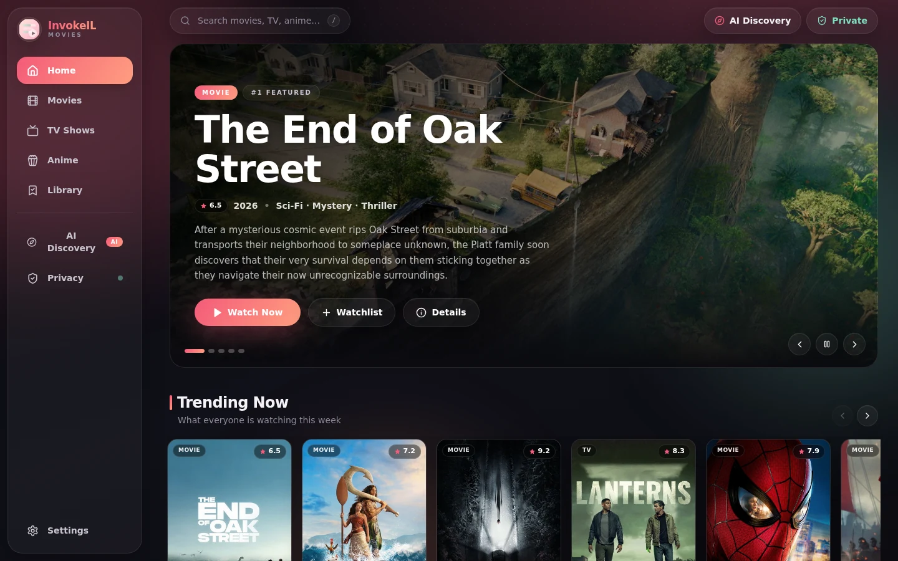
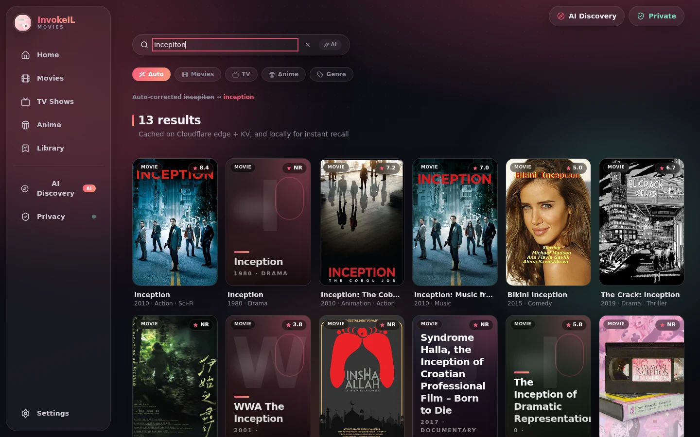
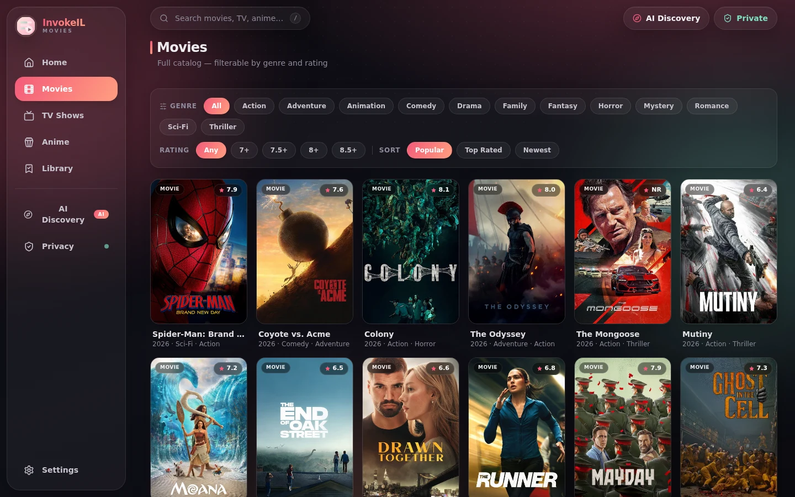
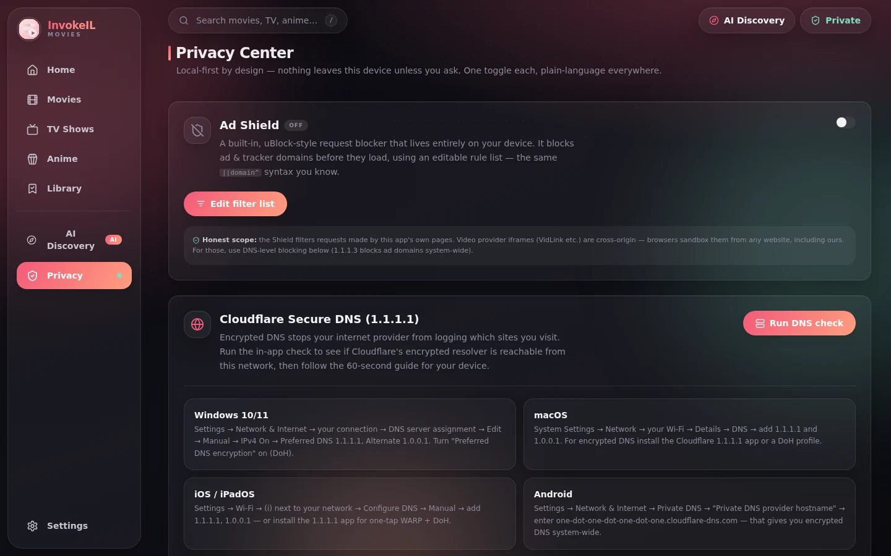
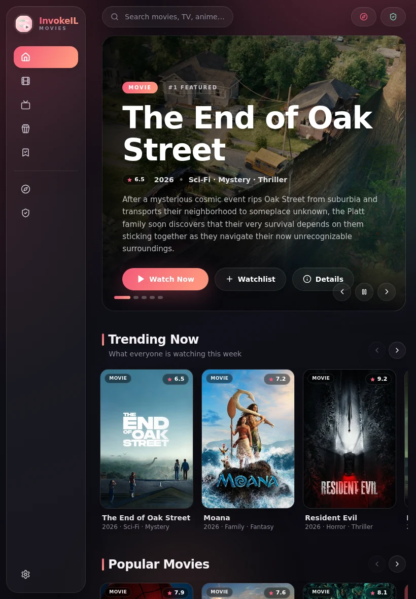
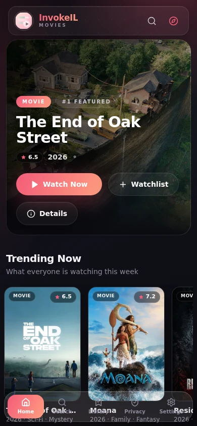
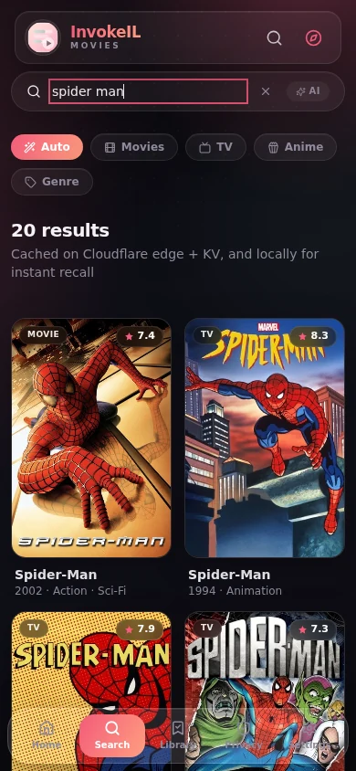

<div align="center">

# 🎬 Movies by InvokeIL

**Watch & discover movies, TV shows and anime — fast, private, and free.**

**No account. No tracking. Your data never leaves your device.**

**► Live site: [movies.invokeil.cfd](https://movies.invokeil.cfd)**

[](https://github.com/Invokeil/Movies-By-Invokeil/releases/latest)
[](https://nextjs.org)
[](https://react.dev)
[](https://www.typescriptlang.org)
[](https://workers.cloudflare.com)
[](./LICENSE)

</div>

---

## 📖 What is this? (read this first!)

**Movies by InvokeIL** is a streaming *discovery* app — think of it as a
beautiful, privacy-friendly shell around TMDB's catalog. You can:

1. 🔍 **Find** any movie, TV show or anime — even if you spell it wrong
2. ▶️ **Watch** it instantly through a built-in player with automatic source
   fallback (if one source is down, the app quietly switches to the next)
3. 🔖 **Save** titles to your watchlist and resume where you left off
4. 🤖 **Ask AI** things like *"a mind-bending heist movie from the 2010s"* and
   get real recommendations
5. 🛡️ **Stay private** — built-in ad/tracker shield, no account, all data
   stored in *your own browser*

> 🧠 **New to GitHub / web apps?** No problem. As a **viewer** you don't need
> to install anything — just open
> [movies.invokeil.cfd](https://movies.invokeil.cfd) in any browser (phone,
> tablet, laptop, or TV). Everything below the *Screenshots* section is only
> for developers who want to run or deploy their own copy.

---

## 📸 Screenshots

### 💻 Laptop / Desktop (1440×900)

| Home | Smart Search |
|---|---|
|  |  |
| **Browse & Filter** | **Privacy Center** |
|  |  |

### 📱 Tablet (820×1180 — iPad)

| Home |
|---|
|  |

### 📱 Mobile (390×844 — iPhone)

| Home | Search |
|---|---|
|  |  |

> The layout adapts to every screen: **phones** get a thumb-friendly bottom
> nav, **tablets** get a compact rail, **desktops/laptops** get the full glass
> sidebar, and **TVs** get 10-foot mode with D-pad (remote) navigation.

---

## ✨ Features — explained in plain language

### 🔍 Smart Search (the best part — try it!)

One search box that understands *everything* you throw at it:

| You type | What happens |
|---|---|
| `incepiton` | ✅ Auto-corrected → **Inception (2010)** — typos are fixed automatically, you even see *"Auto-corrected incepiton → inception"* above the results |
| `horrro movies` | ✅ Detects you mean the **Horror** genre (misspellings included: `scify` → Sci-Fi) and opens a genre browse |
| `funny movie for kids` | ✅ Reads like a description → **AI Mode engages automatically** and recommends real titles with reasons |
| `batman`, then click **Movies** chip | ✅ Scope chips (Auto · Movies · TV · Anime · Genre) narrow results to exactly what you want |
| `/` (the slash key) | ✅ Jumps straight into search from anywhere |

Plus **"did you mean"** suggestions from your own recent searches, a visual
**genre browser**, and results cached on Cloudflare's edge so repeat searches
feel instant.

### ▶️ Playback that just works

The player tries multiple embed sources **in order** and falls back
automatically when one fails, so a broken source never blocks your watch
session. Playback position is saved per title & episode — come back tomorrow
and hit ▶ to resume exactly where you stopped. Navigate away mid-episode and a
**mini-player** keeps it running.

### 🤖 AI Discovery

Describe a mood, get real titles: *"cozy animated film for kids"*, *"dark
space thriller"*, *"something like Interstellar but newer"*. The Worker runs a
fallback chain (**Gemini → Groq → Cloudflare Workers AI**) so recommendations
keep working even if one provider is down. Each pick comes with a one-line
**why**.

### 👫 Duo Watch Party (new!)

Watch the **same movie at the same second** with your partner — built for
the "nibba nibbi" long-distance movie night:

1. **Settings → Partner Share** → *Create private invite link* → send it to
   your partner (WhatsApp, anywhere). The link's secret lives after the `#`
   in the URL — **browsers never send that part to any server**, so the
   tunnel is private by construction.
2. Your partner opens it once → both devices are paired. A **Duo** button
   now appears on every movie/TV detail page.
3. Press **Duo** → start watching. Your partner is pulled into the *same
   title at your exact moment* — automatically, with a live drift meter and
   a **Jump to partner** button if they ever fall behind.
4. When both of you are connected the player shows three buttons —
   **Chat · Voice · Video**:
   - **Chat** is end-to-end encrypted (AES-GCM over a direct WebRTC
     DataChannel) — even the server only routes anonymous ciphertext, and
     nothing is ever saved.
   - **Voice** is full-quality P2P audio mixed with **3D spatial sound**
     (your partner's voice sits beside the screen — toggle 3D/2D anytime).
   - **Video** puts your partner's camera in a corner tile of the player,
   PiP-style.
5. Need to rotate the invite? **Regenerate** — and if your partner is
   online, the app asks for *their permission first*.

No accounts, no rooms to configure, no server-side chat logs. Two people,
one tunnel, everything else stays out.

### 🛡️ Privacy Center (all built in, no extensions needed)

| Tool | What it does |
|---|---|
| **Ad Shield** | uBlock-style request blocker that runs on your device, with an editable `||domain^` filter list and a live blocked-counter |
| **Secure DNS check** | One-tap test whether Cloudflare **1.1.1.1 encrypted DNS** is reachable on your network, plus 60-second setup guides for Windows, macOS, iOS/iPadOS and Android |
| **Private Session** | Temporarily pauses all history/progress recording |
| **Data Vault** | Export, import or wipe *everything* the app knows about you — one tap |

### ⚡ Speed: cached everywhere, so it loads like magic

| Cache layer | What it stores | TTL |
|---|---|---|
| **Cloudflare KV** (global) | Search results, title details, lists, OMDb ratings — the **first** viewer pays the upstream round-trip, **everyone after** reads from CF storage | search 24 h · details 7 d · lists 6 h · OMDb 7 d |
| **Cloudflare R2** (persistent) | Every poster/backdrop/cast image — served from R2 after the first-ever fetch, never re-downloaded | forever |
| **Cloudflare Cache API** (per-colo edge) | Hot API responses + images + head-patched HTML shells (keyed by the deployment's own asset revision) | minutes–hours |
| **IndexedDB** (your browser) | Your own history, library, watch progress, preferences | until you clear it |

Result: the most popular searches and images are served in **milliseconds**
from Cloudflare's network — no API keys in the browser, no upstream hammering.

**Deploy-safe HTML delivery** (the invariant that keeps refreshes working):
every HTML response is stamped `CDN-Cache-Control: no-store` + `max-age=0,
must-revalidate`, so any page refresh always re-enters the Worker — which
serves only the shell of the *currently deployed* build. Content-hashed
build files (`/_next/static/*`) are the opposite: `max-age=1 y, immutable`.
A new deploy therefore swaps HTML + chunk hashes atomically — a stale cached
page can never reference a deleted chunk, so CSS/JS 404s after refresh are
structurally impossible. IMDb-style deep links (`/movie/tt1375666`) are
resolved via TMDB `/find` and 301-redirected to the canonical numeric URL.

### 🖥️ Works on every screen

- 📱 **Mobile** — bottom navigation, safe-area aware, installable as a PWA
- 💻 **Laptop / Desktop** — full glass sidebar + keyboard shortcuts (`/` to search)
- 📺 **TV** — 10-foot UI with spatial (D-pad / arrow-key / remote) navigation

---

## 🧱 Tech stack

| Layer | Technology |
|---|---|
| Frontend | Next.js 16 (static-export SPA), React 19, TypeScript, Tailwind CSS 4, Lucide icons |
| Local storage | Dexie.js (IndexedDB) — history, library, progress, preferences |
| Edge runtime | Cloudflare Workers (zero-dependency TypeScript worker) |
| Static hosting | Cloudflare Workers Static Assets (SPA fallback) + custom domain |
| Metadata | TMDB v3/v4 API (called only by the Worker) |
| Ratings | OMDb API (cached 7 days in KV) |
| AI | Gemini → Groq → Cloudflare Workers AI fallback chain |
| Storage | Cloudflare R2 (images) · KV (metadata/search cache) · Cache API (edge) |

## 🏗️ Architecture in one picture

```
Browser (SPA + IndexedDB — holds ZERO keys)
   │
   ├─ /api/media ─► Worker ─► Cache API (L1) ─► KV (L2, 24 h search cache) ─► TMDB
   ├─ /api/img   ─► Worker ─► R2 (persistent) ─► Cache API ─► image.tmdb.org
   ├─ /api/omdb  ─► Worker ─► KV (7 d) ─► OMDb (key injected server-side)
   ├─ /api/ai    ─► Worker ─► Gemini ─► Groq ─► Workers AI
   └─ /watch/*   ─► auto-fallback embed player (VidLink → mirrors)
```

The full deep-dive — all four architecture diagrams, caching tables, per-endpoint
data flow and the security model — lives in **[ARCHITECTURE.md](./ARCHITECTURE.md)**.

## 📁 Project structure

```
├─ src/
│  ├─ app/                 # Next.js App Router (single-route SPA shell)
│  ├─ components/          # views (home/search/browse/detail/watch/…), media, player, ai, ui
│  ├─ hooks/               # use-mobile, use-toast
│  ├─ lib/                 # api client, Dexie schema, router, services (incl. search-engine.ts), types
│  └─ legacy-api/          # retired sandbox-only routes (not built; kept for reference)
├─ worker/
│  ├─ src/worker.ts        # zero-dep Cloudflare Worker (API + static assets + SEO/AEO layer)
│  ├─ src/media-gateway.ts # /api/media: TMDB mapping, unified model, KV cache tiers
│  ├─ src/seo.ts           # crawler head-patching, sitemap, bot pages
│  ├─ wrangler.jsonc       # bindings: ASSETS, KV(CACHE), R2(IMAGES), Workers AI
│  ├─ deploy.sh            # credential-aware deploy script
│  └─ .dev.vars.example    # template for local `wrangler dev` secrets
├─ docs/
│  ├─ diagrams/            # architecture figures
│  └─ screenshots/         # real UI screenshots (desktop / tablet / mobile)
├─ public/                 # PWA manifest, favicon set, robots.txt
└─ prisma/                 # scaffold schema (unused — the app is local-first)
```

---

## 🚀 Run your own copy (developer guide)

### Prerequisites

- [Bun](https://bun.sh) ≥ 1.2 (or Node.js ≥ 20 + npm)
- A free [TMDB](https://www.themoviedb.org/settings/api) account → **API v4 Read Access Token**
- A free [Cloudflare](https://dash.cloudflare.com) account for deployment
- Optional: [OMDb](https://www.omdbapi.com/apikey.aspx), [Google AI Studio](https://aistudio.google.com) (Gemini), [Groq](https://console.groq.com)

### 1 · Install & run locally

```bash
bun install
bun run dev          # dev server on http://localhost:3000
```

> The app shows a built-in demo catalog until a Worker API is connected, so
> you can develop the UI with zero keys.

### 2 · Build the static SPA

```bash
bun run build        # static export → ./out
```

### 3 · Deploy to Cloudflare

```bash
# credentials live in a git-ignored file the deploy script reads:
#   .env.cloudflare  →  CLOUDFLARE_API_TOKEN=…  /  CLOUDFLARE_ACCOUNT_ID=…
cd worker
./deploy.sh          # deploys Worker + ./out assets + custom domain
```

**Or let GitHub do it** — `.github/workflows/deploy.yml` builds & deploys on
every push to `main`. One-time setup: add `CLOUDFLARE_API_TOKEN` and
`CLOUDFLARE_ACCOUNT_ID` under *Settings → Secrets and variables → Actions*.

### 4 · Provision secrets (never commit these!)

```bash
cd worker
bunx wrangler secret put TMDB_API_TOKEN    # TMDB v4 read token (required)
bunx wrangler secret put OMDB_API_KEY      # ratings enrichment (optional)
bunx wrangler secret put GEMINI_API_KEY    # AI tier 1 (optional)
bunx wrangler secret put GROQ_API_KEY      # AI tier 2 (optional)
bunx wrangler secret put TMDB_DEMO_KEY     # v3 api_key fallback (optional)
```

For local `wrangler dev`: copy `worker/.dev.vars.example` → `worker/.dev.vars`
and fill the same values (`.dev.vars` is git-ignored).

## 🔐 Secrets & key handling

**No API key ever reaches the browser or this repository.** All provider
credentials are Cloudflare Worker secrets resolved at runtime. `account_id` is
deliberately excluded from `wrangler.jsonc` and injected from the
`CLOUDFLARE_ACCOUNT_ID` environment variable at deploy time. The full policy —
including what to do if a key leaks — is documented in
**[SECURITY.md](./SECURITY.md)**.

---

## ❓ FAQ (beginner-friendly)

**Is it free?** Yes. The site runs entirely on Cloudflare's free tier and
TMDB's free API.

**Do I need an account?** No — there is no signup, no login, no email. Your
watchlist and history live in *your browser only*.

**Where is my data stored?** In your browser's IndexedDB. Clearing it (Privacy
Center → Data Vault → Wipe, or clearing site data) removes everything.

**Does the app host any videos?** No. Playback uses third-party embeds; the
app hosts none of the content. If an embed source is down, the player
auto-falls-back to the next one.

**Why is search so fast?** Results are cached in Cloudflare KV on first fetch
and served from the edge to everyone after — repeat searches never touch TMDB.

**Can I use it on my TV?** Yes — open the site in a TV browser; arrow/remote
keys navigate the 10-foot UI.

## 🗺️ Roadmap / known issues

- Home feed personalisation v2 — behaviour-driven rails are in place; default demo entries still appear for brand-new sessions with no history.
- VidLink embed diagnostics — some environments trigger the graceful fallback panel; the "open in new tab" escape hatch works in all of them.
- Optional service worker for full offline PWA support (the Ad Shield already ships as a service worker when armed).
- Duo deep-sync note: automatic position landing uses VidLink's start-position parameter; on other providers the partner lands at the title start and one tap of **Jump to partner** re-aligns — constrained by what third-party embeds expose.
- ~~Refresh after a deploy could load stale HTML referencing deleted chunk hashes (CSS/JS 404s)~~ — **fixed**: HTML is `CDN-Cache-Control: no-store` + always revalidated; only content-hashed assets are immutable; the zone cache is purged on deploys that change delivery semantics.

## ⚖️ Attribution & disclaimer

- This product uses the **TMDB API** but is not endorsed or certified by [TMDB](https://www.themoviedb.org).
- Ratings metadata via the [OMDb API](https://www.omdbapi.com).
- Playback uses third-party embeds; this project hosts no video content itself.
- All user data stays in the visitor's browser (IndexedDB) — no account system, no analytics.

## 📄 License

Released under the [MIT License](./LICENSE) — © 2026 Invokeil.
