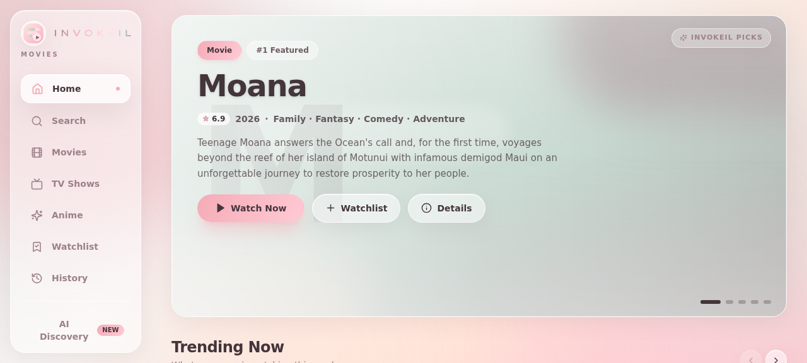

# 🎬 Movies by InvokeIL

**Privacy-first, local-first movie & TV discovery — running entirely on Cloudflare's free tier.**

Live at **[movies.invokeil.cfd](https://movies.invokeil.cfd)**

[](https://nextjs.org)
[](https://www.typescriptlang.org)
[](https://workers.cloudflare.com)
[](./LICENSE)
[](./CONTRIBUTING.md)

Movies by InvokeIL is a glassmorphism-styled streaming discovery portal. Every
user preference, watch-history entry and playback position is stored **only on
the user's own device** (IndexedDB) — there is no user account, no tracking
pixel and no server-side profile. Metadata and images are fetched through a
Cloudflare Worker and cached aggressively at the edge, in KV and in R2, so the
site stays fast and cheap while the browser never holds a single API key.

<p align="center">
  
</p>

---

## ✨ Features

- **Glassmorphism UI** — five soft-glass accent palettes (`#D8E2DC #FFE5D9 #FFCAD4 #F4ACB7 #9D8189`), switchable in Settings, with desktop + mobile layouts.
- **Smart Search (one pill, every way to find something)** — a single glass pill (press `/` anywhere) that auto-detects intent: typo-tolerant title search ("incepiton" still finds *Inception*), genre detection with misspellings ("scify" → Sci-Fi, "horrro" → Horror), scope chips (Auto · Movies · TV · Anime · Genre), a full genre browser, and a **built-in AI Mode** that auto-engages when a query reads like a description.
- **Real artwork everywhere** — posters, backdrops and cast photos are proxied through `/api/img` and **persisted in R2 on first fetch**, so every image after the first viewer is served from Cloudflare storage.
- **Global KV caching** — search results (24 h), title details (7 d) and lists (6 h) are stored in Cloudflare KV: the first viewer pays the TMDB round-trip, every viewer after that reads from CF storage. OMDb lookups are cached for 7 days. Repeat searches never touch TMDB/OMDb again.
- **Local-first behaviour** — watch history, continue-watching positions, My List and palette choice live in IndexedDB via Dexie. Clear them any time from the Privacy Center; nothing ever leaves the device.
- **Privacy Center** — a built-in uBlock-style Ad Shield (editable `||domain^` filter list + live blocked counter), Cloudflare 1.1.1.1 DoH status check with per-platform setup guides, a Private Session toggle that pauses all recording, and a one-tap Data Vault (export / import / wipe).
- **Continue watching & mini-player** — resumable playback positions per title, a floating mini-player when you navigate away, and a library with Watching / Plan-to-watch tabs.
- **AI recommendations** — a server-side fallback chain (Gemini → Groq → Cloudflare Workers AI) ranks candidate titles with a reason for each pick, with a 10-minute result cache.
- **Search & browse** — multi-search across movies and TV, genre rows, mood discovery, trending / popular / top-rated / new-release rails, anime rail.
- **Rich detail pages** — cast, runtime, seasons, tagline, IMDb rating / Metascore / awards enrichment via OMDb, and similar-title recommendations.
- **VidLink player** — embedded playback per movie/TV episode with a graceful fallback panel (including an "open in new tab" escape hatch) when an embed cannot start.
- **TV-ready** — 10-foot TV mode with spatial (D-pad/remote) navigation, plus complete PWA icons (SVG + raster favicon set + maskable) for installability on every platform.

## 🧱 Tech stack

| Layer | Technology |
|---|---|
| Frontend | Next.js 16 (static export SPA), React 19, TypeScript, Tailwind CSS 4, Lucide icons |
| Local storage | Dexie.js (IndexedDB) — history, library, progress, preferences |
| Edge runtime | Cloudflare Workers (zero-dependency TypeScript worker) |
| Static hosting | Cloudflare Workers Static Assets (SPA fallback), custom domain |
| Metadata | TMDB v3/v4 API (via the Worker only) |
| Ratings enrichment | OMDb API (via the Worker only) |
| AI | Gemini → Groq → Workers AI fallback chain (via the Worker only) |
| Storage | Cloudflare R2 (images) + KV (metadata cache) + Cache API (edge) |

## 🏗️ Architecture

```
Browser (SPA, IndexedDB, zero keys)
   │
   ├─ /api/media ─►  Worker  ─►  Cache API (L1) ─► KV (L2, incl. 24 h search cache) ─► TMDB
   ├─ /api/img   ─►  Worker  ─►  R2 (persistent) ─► Cache API ─► image.tmdb.org
   ├─ /api/omdb  ─►  Worker  ─►  KV (7 d) ─► OMDb (key injected server-side)
   ├─ /api/ai    ─►  Worker  ─►  Gemini ─► Groq ─► Workers AI
   └─ /watch/*   ─►  VidLink embed (third-party player)
```

The full deep-dive — including all four architecture diagrams, caching-layer
tables, the data flow for every endpoint and the security model — lives in
**[ARCHITECTURE.md](./ARCHITECTURE.md)**.

## 📁 Project structure

```
├─ src/
│  ├─ app/                 # Next.js App Router (single-route SPA shell)
│  ├─ components/          # views (home/search/browse/detail/watch/…), media, player, ai, ui
│  ├─ hooks/               # use-mobile, use-toast
│  ├─ lib/                 # api client, Dexie schema, router, services, types, demo catalog
│  └─ legacy-api/          # retired sandbox-only routes (not built; kept for reference)
├─ worker/
│  ├─ src/worker.ts        # zero-dep Cloudflare Worker (API + static assets + security headers)
│  ├─ src/media-gateway.ts # /api/media: TMDB mapping, unified model, cache tiers
│  ├─ wrangler.jsonc       # bindings: ASSETS, KV(CACHE), R2(IMAGES), Workers AI
│  ├─ deploy.sh            # credential-aware deploy script
│  └─ .dev.vars.example    # template for local `wrangler dev` secrets
├─ docs/
│  ├─ diagrams/            # architecture figures
│  └─ screenshots/         # UI screenshots
├─ public/                 # PWA manifest, icons, robots.txt
└─ prisma/                 # scaffold schema (unused by the app — it is local-first)
```

## 🚀 Getting started

### Prerequisites

- [Bun](https://bun.sh) ≥ 1.2 (or Node.js ≥ 20 + npm)
- A free [TMDB](https://www.themoviedb.org/settings/api) account → **API v4 Read Access Token**
- A (free) [Cloudflare](https://dash.cloudflare.com) account for deployment
- Optional keys: [OMDb](https://www.omdbapi.com/apikey.aspx), [Google AI Studio](https://aistudio.google.com) (Gemini), [Groq](https://console.groq.com)

### 1. Install & run locally

```bash
bun install
bun run dev          # Next.js dev server on http://localhost:3000
```

The app runs with its built-in demo catalog until a Worker API is available.

### 2. Build the static SPA

```bash
bun run build        # outputs the static export to ./out
```

### 3. Deploy to Cloudflare

```bash
# credentials (git-ignored, never committed):
#   ../.env.cloudflare  →  CLOUDFLARE_API_TOKEN=…  /  CLOUDFLARE_ACCOUNT_ID=…
cd worker
./deploy.sh          # deploys Worker + ./out static assets + custom domain route
```

### 4. Provision secrets (never in the repo!)

```bash
cd worker
bunx wrangler secret put TMDB_API_TOKEN    # TMDB v4 read token (required)
bunx wrangler secret put OMDB_API_KEY      # ratings enrichment (optional)
bunx wrangler secret put GEMINI_API_KEY    # AI tier 1 (optional)
bunx wrangler secret put GROQ_API_KEY      # AI tier 2 (optional)
bunx wrangler secret put TMDB_DEMO_KEY     # v3 api_key fallback (optional)
```

For local `wrangler dev`, copy `worker/.dev.vars.example` → `worker/.dev.vars`
and fill the same values. `.dev.vars` is git-ignored.

## 🔐 Secrets & key handling

**No API key ever reaches the browser or this repository.** All provider
credentials are Cloudflare Worker secrets resolved at runtime. `account_id` is
deliberately excluded from `wrangler.jsonc` and injected from the
`CLOUDFLARE_ACCOUNT_ID` environment variable at deploy time. The full policy —
including what to do if a key leaks — is documented in
**[SECURITY.md](./SECURITY.md)**.

## 🗺️ Roadmap / known issues

- Home feed personalisation v2 — behaviour-driven rails are in place; default demo entries still appear for brand-new sessions with no history.
- VidLink embed diagnostics — some environments trigger the graceful fallback panel; the "open in new tab" escape hatch works in all of them.
- Optional service worker for full offline PWA support (the Ad Shield already ships as a service worker when armed).

## ⚖️ Attribution & disclaimer

- This product uses the **TMDB API** but is not endorsed or certified by [TMDB](https://www.themoviedb.org).
- Ratings metadata via the [OMDb API](https://www.omdbapi.com).
- Playback uses third-party **VidLink** embeds; this project hosts no video content itself.
- All user data stays in the visitor's browser (IndexedDB) — there is no account system and no analytics.

## 📄 License

Released under the [MIT License](./LICENSE) — © 2026 Invokeil.
